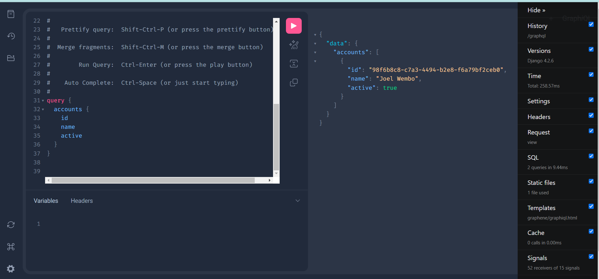

# Django-multitenant-saas-ecommerce-project
## Automating Django , Celery , Redis and postgres deployment to AWS EC2 using Terraform ( Complete Guide)


- [@Joel O. Wembo](https://www.joelotepawembo.com)
- [@twitter](twitter.com/joelwembo1)
- [@linkedin](https://www.linkedin.com/in/joelotepawembo)


## Introduction
Automating deployment processes is crucial for modern web development, enhancing productivity and reliability. In this article, we focus on automating the deployment of a Django web application onto an Ubuntu Server hosted on AWS EC2.


### Prerequisites:
Before we get into the good stuffs, first we need to make sure we have the required services on our local machine or dev server, which are:

- Basic knowledge of Django
- AWS Account
- Github Account
- AWS CLI installed and configured.
- ECS CLI
- Docker installed locally.
- Typescript installed
- Postman
- Python 3
- NPM
- NodeJS
- Terraform
- A Domain name Hosted from any domain name provider ( Ex: AWS Route 53 )
- Basic familiarity with YAML and GitHub workflows.
- A Django project hosted in a GitHub repository
- Basic knowledge of HTML or React
- Any Browser for testing
- Intermediate knowledge in Serverless Computing ( Ex : AWS Lambda , ECS,..)

You can follow along with this source code:
GitHub - joelwembo/django-multitenant-saas-ecommerce-kubernetes: Django Multi-tenant …
Django Multi-tenant , microservices , Kubernetes, Jenkins, Github Actions and Multiple Databases using docker, bash…
github.com

## Steps

## Step 1: Create a virtual environment to hold all pip libraries installations

If you don’t have virtualenv installed, you can install it by running the following command in your CMD after Python was installed:

Create virtual environment for Python
    ```
    python3 -m venv .venv
    ```
## Step 2 : Activate the environment:

```
source ./venv/bin/activate
source ./venv/bin/deactivate ( To Deactivate )
```

### Step 3: Create project folder
```
mkdir app
```
## Step 4: Install Django

pip install django
## Step 5: Create a new Django project inside the project folder

A Django app is a self-contained component of a Django project. It is a module that provides specific functionality, such as handling authentication, managing blog posts, or serving an API. An app should represent a single, specific functionality or purpose within the overall website.

django-admin startproject django-multitenant-saas-ecommerce-kubernetes
## Step 6: Create a new test app:

within the django project using the following command:
```
python manage.py startapp testapp
```
***Adding a new app into the project***
```
python manage.py startapp home apps/home
```

## Step 7 : Execute ORM Data Migrations:
```
python manage.py makemigrations
```
```
python manage.py migrate
```

## Step 8: Launch the django development server
```
python manage.py runserver
```

## Step 9:  create admin user

```
python manage.py createsuperuser
```
## start using shell 
```
bash ./server-entrypoint.sh
```

# Docker
 ```
bash ./run.sh
http://127.0.0.1:8585/
 ```

# API Docs
 ```
http://127.0.0.1:8585/swagger/
 ```
 [@Swagger](http://127.0.0.1:8585/swagger/)

# Data Browser

http://127.0.0.1:8585/data-browser/


# GraphQL

http://127.0.0.1:8585/graphql

# Extensions
python manage.py show_urls
python manage.py graph_models finances -a -o finances_models.png

# wagtail

# Django ledger
 ```
pip install pipenv (globally)
 ```
To activate this project's virtualenv, run pipenv shell.
Alternatively, run a command inside the virtualenv with pipenv run.
 ```
pipenv install django-ledger[graphql,pdf]
 ```
  ```
python manage.py test django_ledger
 ```


# Multi tenant Settings

 ```
pip install -r requirements.txt
 ```
  ```
python manage.py makemigrations finances
 ```
  ```
python manage.py makemigrations app
 ```

 ```
python manage.py migrate finances
 ```
  ```
python manage.py migrate app
 ```
tenant = Client(schema_name="test", name="test Company")

domain = Domain(domain="btest.localhost", tenant=tenant, is_primary=True)


Thank you for Reading !! 🙌🏻, see you in the next article.🤘

# For more information about the author visit

- [@Joel O. Wembo](https://www.joelotepawembo.com)
- [@twitter](twitter.com/joelwembo1)
- [@linkedin](https://www.linkedin.com/in/joelotepawembo)


